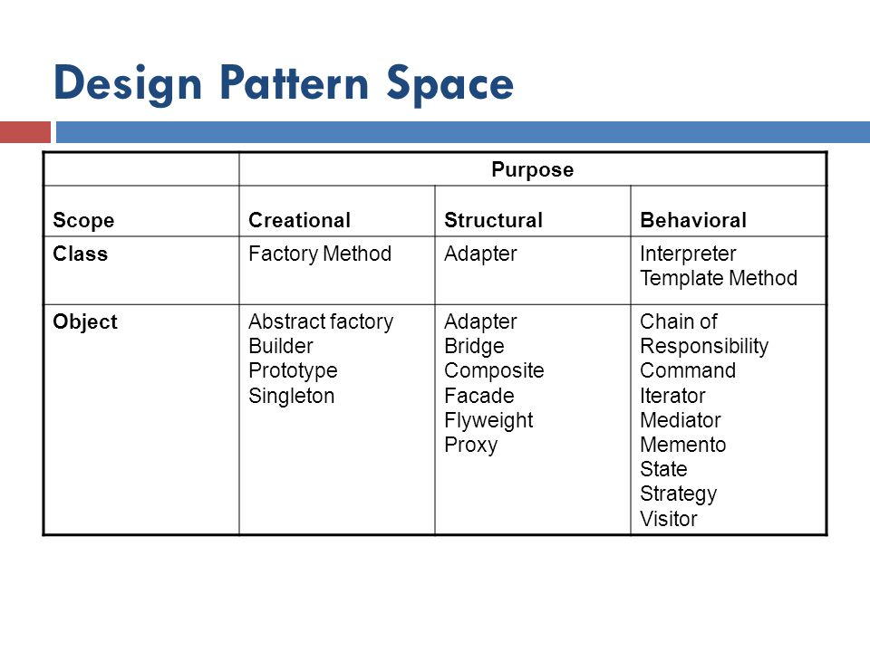

# Design Patterns

## Différence entre principes (SOLID) et patterns 

### Principe 

- Plus générique
- Façon d'organiser l'ensemble de son application (ensemble de classes, modules, dépendences…)

### Design Pattern

- Propositions d'abstractions générales pour résoudre des problèmes récurrents au développement logiciel
- Clé en main, réutilisable, testé et approuvé
- Un design pattern = un problème et une solution précise
- Sont un des moyens d'appliquer les principes SOLID

---

# More on Patterns

- Patterns help you build on the collective experience of skilled software engineers. 
- They capture existing, well-proven experience in software development and help to promote good design practice 
- Every pattern deals with a specific, recurring problem in the design or implementation of a software system 
- Patterns can be used to construct software architectures with specific properties... 
- A design pattern is not a finished design that can be transformed directly into code. It is a description or template for how to solve a problem that can be used in many different situations

---

# Ecosystem of Patterns

## Programming Patterns (idioms)

- low-level pattern specific to a programming language. An idiom describes how to implement particular aspects of components or the relationships between them using the features of the given language.
- example : string copy in C `(while (*d++=*s++);`
- another example : the "convert to boolean" pattern using the double negation in javascript : `var bHasItems = !!myArray.length`

## Design Patterns

- A design pattern provides a scheme for refining the subsystems or components of a software system, or the relation ships between them. It describes a commonly-recurring structure of  communicating components that solves a general design problem within a particular context. 

## Architectural Patterns

- fundamental structural organization schema for software systems. It provides a set of predefined subsystems, their responsibilities,  and includes rules and guidelines for organizing the relationships between them. 
- example of concerns handled by architectural patterns : layers, distribution, security, MVC, …
- implementations of architectural patterns are delivered by frameworks, for example : 
    - web frameworks : Symfony, Laravel (PHP), Ruby on Rails (Ruby), Django (Python), …
    - Application & GUI frameworks : QT (GUI, multi language), .NET (Windows applications, multi language, primarly C#), Swing (GUI, Java)

---

# Dans ce cours

- Les design patterns proposé par le Gang Of Four (GoF)
- Livre paru en 1994 "Design Patterns: Elements of Reusable Object-Oriented Software"
- Auteurs : 
    - Erich Gamma
    - Richard Helm
    - Ralph Johnson
    - John Vlissides

---

# Quelques ressources externes

Les design patterns du GoF sont très répandus, donc il est facile de trouver des ressources en ligne pour s'en imprégner (en 
complément du cours).

Quelques ressources en anglais : 

- Tutoriels Youtube par Derek Banas <https://www.youtube.com/playlist?list=PLF206E906175C7E07>
- Chaque pattern détaillé avec un example Java et son diagramme UML : <https://www.journaldev.com/31902/gangs-of-four-gof-design-patterns>
- Une présentation plus générique des pattenrs, avec diagrammes UML génériques : <http://www.blackwasp.co.uk/gofpatterns.aspx>
- Voir le PDF "GangOfFour_reference.pdf" dans le repo du cours, pour un récapitulatif synthétique

---

# Commençons par un exemple concret

We have a program that displays the names and phones of a list of people. We rely on an interface `PhoneListInterface` that defines
a methode `Array<Phone> getPhoneList()`, the object `Phone` is one of our classes.

Depending on an interface instead of an concrete implementation is a way of observing the "Dependency inversion principle" of SOLID principles. This
way we can easily use different implementations as our needs evolve.

Currently, we use an implementation provided by a third party library (that means, we can't edit the code ourselves). The implementions provides a class
`PersonnelPhoneGetter` which implements a method `Array<Array<String>> getPersonnelPhones()`.

It does what we want, but the signature of the method doesn't match with our interface (different method name & different way of formatting the data).

We solve this problem by writting a class to make some "translation" between the two piece of softwares, which we call `PhoneListAdapter`.

--- 

# Les 3 familles de patterns

## Creational Patterns

Creational patterns provide ways to instantiate single objects or groups of related objects. There are five such patterns:

## Structural Patterns

These design patterns concern class and object composition. Concept of inheritance is used to compose interfaces and define ways to compose objects to obtain new functionalities.

## Behavioral Patterns

Most of these design patterns are specifically concerned with communication between objects. 

---

# Une autre catégorisation des patterns

Classification par Scope (orthogonal aux familles)

## Class patterns

Deal with static relationships between classes and subclasses. (Compilation time)

## Object patterns

Deal with object relationships (instances) which can be changed at run time.

---

# Tableau récapitulatif

Classement des design patterns par famille et par scope

