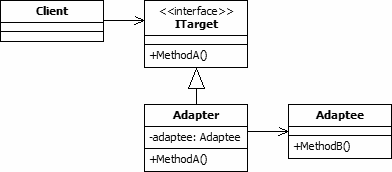
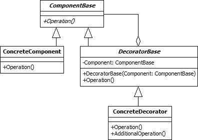
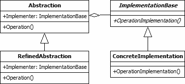
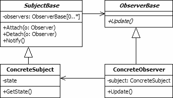
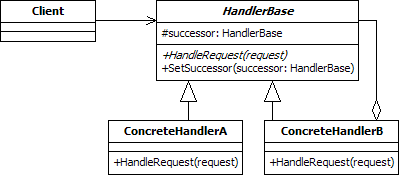
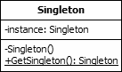

# Design Patterns

## Difference between principles (SOLID) vs. patterns

### SOLID principles

- They are generic
- It's a philosophical way to design the architecture of your application code (how to build and organize classes, modules, dependencies…)

### Design Pattern

- They are concrete proposition of piece of software architecture, designed to solve recurring problems one can find in software development
- You can use them out of the box, they are tested and approved for a long time
- One design pattern = one solution to one specific problem
- They are a way to build software that respect the SOLID principles

---

# More on Patterns

- Patterns help you build on the collective experience of skilled software engineers. 
- They capture existing, well-proven experience in software development and help to promote good design practice 
- Every pattern deals with a specific, recurring problem in the design or implementation of a software system 
- Patterns can be used to construct software architectures with specific properties... 
- A design pattern is not a finished design that can be transformed directly into code. It is a description or template for how to solve a problem that can be used in many different situations

---

# Ecosystem of Patterns

## Programming Patterns (idioms)

- low-level pattern specific to a programming language. An idiom describes how to implement particular aspects of components or the relationships between them using the features of the given language.
- example : string copy in C `(while (*d++=*s++);`
- another example : the "convert to boolean" pattern using the double negation in javascript : `var bHasItems = !!myArray.length`

## Design Patterns

- A design pattern provides a scheme for refining the subsystems or components of a software system, or the relation ships between them. It describes a commonly-recurring structure of  communicating components that solves a general design problem within a particular context. 

## Architectural Patterns

- fundamental structural organization schema for software systems. It provides a set of predefined subsystems, their responsibilities,  and includes rules and guidelines for organizing the relationships between them. 
- example of concerns handled by architectural patterns : layers, distribution, security, MVC, …
- implementations of architectural patterns are delivered by frameworks, for example : 
    - web frameworks : Symfony, Laravel (PHP), Ruby on Rails (Ruby), Django (Python), …
    - Application & GUI frameworks : QT (GUI, multi language), .NET (Windows applications, multi language, primarly C#), Swing (GUI, Java)

---

# In this lecture

- The design patterns presented here were published by the "Gang Of Four", that is a collective of authors
- The book was published in 1994 "Design Patterns: Elements of Reusable Object-Oriented Software"
- Authors : 
    - Erich Gamma
    - Richard Helm
    - Ralph Johnson
    - John Vlissides

---

# Some external resources

These design patterns are widespread, it is easy to fin online resources that describe and explain them in different ways.

Below, a compilation of some of these resources : 

- Youtube tutorials by Derek Banas <https://www.youtube.com/playlist?list=PLF206E906175C7E07>
- Every pattern detailed with a Java example and a UML diagram : <https://www.journaldev.com/31902/gangs-of-four-gof-design-patterns>
- A generic presentation of patterns with UML diagrams : <http://www.blackwasp.co.uk/gofpatterns.aspx>
- In the lecture git repository, you will a document "GangOfFour_reference.pdf"
- Another presentation of the patterns, with examples : <https://www.oodesign.com/proxy-pattern.html>

---

# Let's begin with a concrete example

We have a program that displays the names and phones of a list of people. We rely on an interface `PhoneListInterface` that defines
a methode `Array<Phone> getPhoneList()`, the object `Phone` is one of our classes.

Depending on an interface instead of an concrete implementation is a way of observing the "Dependency inversion principle" of SOLID principles. This
way we can easily use different implementations as our needs evolve.

Currently, we use an implementation provided by a third party library (that means, we can't edit the code ourselves). The implementions provides a class
`PersonnelPhoneGetter` which implements a method `Array<Array<String>> getPersonnelPhones()`.

It does what we want, but the signature of the method doesn't match with our interface (different method name & different way of formatting the data).

We solve this problem by writting a class to make some "translation" between the two piece of softwares, which we call `PhoneListAdapter`.

--- 

# The 3 families of Design Patterns

## Creational Patterns

Creational patterns provide ways to instantiate single objects or groups of related objects. There are five such patterns:

## Structural Patterns

These design patterns concern class and object composition. Concept of inheritance is used to compose interfaces and define ways to compose objects to obtain new functionalities.

## Behavioral Patterns

Most of these design patterns are specifically concerned with communication between objects. 

---

# Another way to classify : by scope

This classification is orthogonal to the classification by families.

## Class patterns

Deal with static relationships between classes and subclasses. (Compilation time)

## Object patterns

Deal with object relationships (instances) which can be changed at run time.

---

# Summary table of Design Patterns classification

---

# Structural Patterns

- Adapter pattern
- Decorator pattern
- Bridge pattern
- Proxy pattern

---

# Adapter Pattern

## Motivation

The adapter pattern is adapting between classes and objects. Like any adapter in the real world it is used to be an interface, a bridge between two objects

## Intent

- Convert the interface of a class into another interface clients expect.
- Adapter lets classes work together, that could not otherwise because of incompatible interfaces.

---

# Adapter Pattern

- Can be implemented with inheritance (thus, a Class Pattern)
- Can be implemented with composition and delegation (thus, an Object Pattern)

See the two ways of solving the PhoneList example

---

# Decorator Pattern

## Motivation

Extending an object's functionality can be done statically (at compile time) by using inheritance however it might be necessary to extend an object's functionality dynamically (at runtime) as an object is used.

## Intent

The intent of this pattern is to add additional responsibilities dynamically to an object.

---

# Decorator

- See the example in `./examples/DecoratorExample`
- Do the exercise in `./exercises/DecoratorExercise`

---

# Bridge

## Motivation

Sometimes an abstraction should have different implementations; consider an object that handles persistence of objects over different platforms using either relational databases or file system structures (files and folders). A simple implementation might choose to extend the object itself to implement the functionality for both file system and RDBMS. However this implementation would create a problem; Inheritance binds an implementation to the abstraction and thus it would be difficult to modify, extend, and reuse abstraction and implementation independently.

## Intent

The intent of this pattern is to decouple abstraction from implementation so that the two can vary independently

---

# Bridge

- See the example in `./examples/BridgeExample2`
- Do the exercise in `./exercises/BridgeExercises`

---

# Proxy

# Motivation

Sometimes we need the ability to control the access to an object.

The proxy design pattern is used to provide a surrogate or placeholder object, which references an underlying object. The proxy provides the same public interface as the underlying subject class. It adds a level of indirection by accepting requests from a client object and passing these to the real subject object as necessary

# Intent

The intent of this pattern is to provide a Placeholder for an object to control references to it

---

# Proxy

## Types of proxies

- Cache Proxy : A cache proxy improves the performance of the underlying object's.
- Protection Proxy : A protection proxy adds a layer of security to the underlying subject object. 
- Remote Proxy : A remote proxy provides a local object that references a subject object in another location, generally via a network connection.
- Smart Proxy : Smart proxies add extra functionality to the calls to the real object's members.  (examples : logging, counting…)

---

# Behavioral patterns

- Iterator
- Chain of command
- Observer

---

# Iterator pattern

## Motivation

One of the most common data structures in software development is what is generic called a collection. A collection is just a grouping of some objects. They can have the same type or they can be all cast to a base type like object. A collection can be a list, an array, a tree and the examples can continue.

But what is more important is that a collection should provide a way to access its elements without exposing its internal structure. We should have a mechanism to traverse in the same way a list or an array. It doesn't matter how they are internally represented. 

## Intent

- Provide a way to access the elements of an aggregate object sequentially without exposing its underlying representation. 
- The abstraction provided by the iterator pattern allows you to modify the collection implementation without making any changes outside of collection

---

# Iterator pattern 

---

# Observer Pattern

## Motivation

The cases when certain objects need to be informed about the changes occured in other objects are frequent. To have a good design means to decouple as much as possible and to reduce the dependencies. The Observer Design Pattern can be used whenever a subject has to be observed by one or more observers.

## Intent

Defines a one-to-many dependency between objects so that when one object changes state, all its dependents are notified and updated automatically.

---

# Chain of Responsibility

## Motivation

In writing an application of any kind, it often happens that the event generated by one object needs to be handled by another one. And, to make our work even harder, we also happen to be denied access to the object which needs to handle the event. In this case there are two possibilities: there is the beginner/lazy approach of making everything public, creating reference to every object and continuing from there and then there is the expert approach of using the Chain of Responsibility.

## Intent

- It avoids attaching the sender of a request to its receiver, giving this way other objects the possibility of handling the request too.
- The objects become parts of a chain and the request is sent from one object to another across the chain until one of the objects will handle it.

---

# Chain of Responsibility

---

# Creationnal Patterns

- Singleton
- Factory
- Prototype

---

# Singleton

## Motivation

Sometimes it's important to have only one instance for a class. For example, in a system there should be only one window manager 
(only a file system or only a print spooler). Usually singletons are used for centralized management of internal or external 
resources and they provide a global point of access to themselves.

## Intent

- Ensure that only one instance of a class is created.
- Provide a global point of access to the object.

---

# Singleton

---

# Factory Method

## Motivation

The factory design pattern is used when we have a superclass with multiple sub-classes and based on input, we need to return one of the sub-class. 
This pattern takes out the responsibility of the instantiation of a class from the client program to the factory class.

## Intent

- Defines an interface for creating objects, but let subclasses to decide which class to instantiate

---

# Factory Method

---
